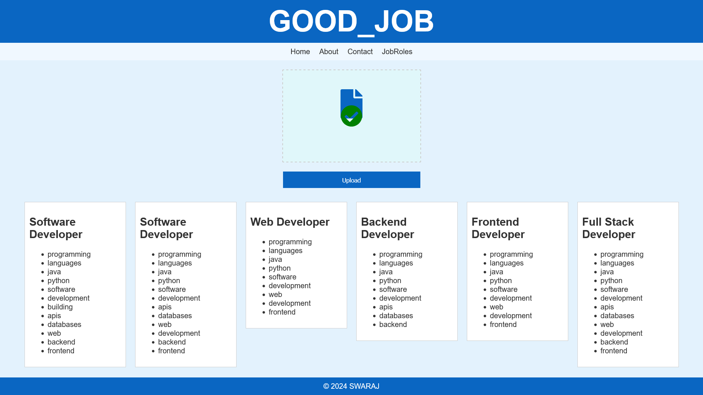

# ⚡ GOODJOB

Welcome to the **TypeScript** version of our **Job Role Suggestion** website! This project leverages the power of **MERN stack** to help users discover job roles based on their resumes.

## 🖥️ Project Overview

This website suggests possible **job roles** by analyzing your resume. Simply upload your resume document, and our system will perform **keyword analysis** to suggest relevant job roles from our predefined database.

### 🔍 How It Works:
1. **Upload** your resume (supports DOC, DOCX, PDF).
2. The system scans for **keywords** and analyzes the content.
3. **Job roles** relevant to the skills and experience in your resume are suggested.


## 🌐 Live Demo

Explore the live version of the TypeScript repository: [reaactgoodjobiv.vercel.app](https://reaactgoodjobiv.vercel.app)

## 📸 Screenshots

You can enhance your README by adding images or screenshots to provide a visual overview of the project! Below is an example of how to do that:

```markdown


```

Simply save your images in a folder like `./screenshots/` within your repository and refer to them in the Markdown using the above format.

## ⚙️ Project Status

This project is still **under development**. We’re continuously working on improving the features and functionality.

### 🌟 Future Directions
We’re planning to integrate **AI-based suggestions** using **ChatGPT Playground** to provide even smarter recommendations for job roles. 🤖

## 🙌 Contributions Welcome!

This project is open for contributions! If you'd like to enhance the project or adapt it for your own use, feel free to fork it. Please note that fair use is allowed, but all rights are reserved by **Raj Nandale**.

## 🛡️ Licensing & Usage

The project is **copyrighted** and owned by **Raj Nandale**. All rights and work are reserved. Reach out if you have any inquiries regarding usage or contributions.

---

A project of **Swaraj InfoTech**, owned by **Raj Nandale**.

---
